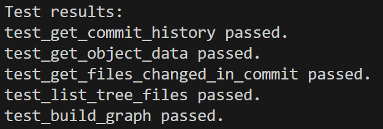

# Dependency Visualizer

**Dependency Visualizer** — это инструмент командной строки для визуализации графа зависимостей коммитов в Git-репозитории. Каждый узел графа содержит список файлов и папок, изменённых в коммите. Для визуализации используется библиотека Graphviz.

---

## Основные функции
- **Анализ истории коммитов Git**: Построение графа на основе зависимости коммитов.
- **Визуализация зависимостей**: Узлы графа содержат информацию о коммитах и затронутых файлах.
- **Сохранение результата**: Генерация графа в формате PNG.

---

## Требования
- Python 3.7+
- Установленный Git (проверить с помощью `git --version`)
- Библиотека Graphviz (и исполняемая программа `dot`)
- Установить зависимости Python:
```bash
pip install graphviz
```
Убедитесь, что Graphviz установлен и доступен в системе:
Для Windows: Скачайте с Graphviz.org и добавьте путь к dot.exe в переменную окружения PATH.
Для Linux/macOS: Установите через пакетный менеджер, например:
```bash
sudo apt install graphviz
brew install graphviz
```
Использование
Визуализация зависимостей
Запустите скрипт с указанием пути к Git-репозиторию и выходному файлу:
```bash
python visualizer_dependency.py --graphviz-path "C:/Program Files/Graphviz/bin/" --repo-path "C:/path/to/git/repository" --output-path "C:/path/to/output/graph"
```
Параметры:
--graphviz-path — путь к папке с программой Graphviz (например, dot.exe).
--repo-path — путь к анализируемому Git-репозиторию.
--output-path — путь и имя выходного файла без расширения (например, ./graph).
После выполнения команда сохранит граф зависимостей в формате PNG в указанное место.

Тестирование
Для проверки корректности работы доступны тесты:
Убедитесь, что тесты находятся в каталоге проекта.
Запустите тесты:
```bash
python test_visualizer.py
```
Результат тестов будет отображён в консоли, а граф тестового репозитория сохранится в файл test_graph.png.
